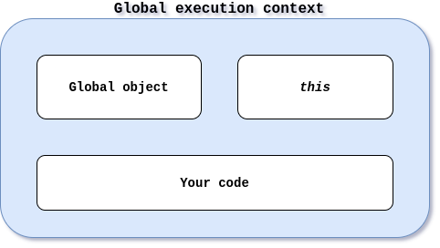
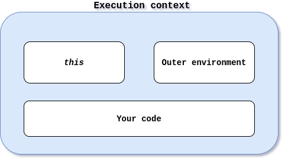
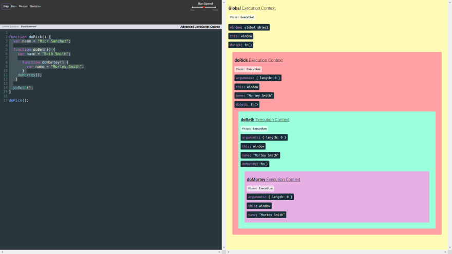
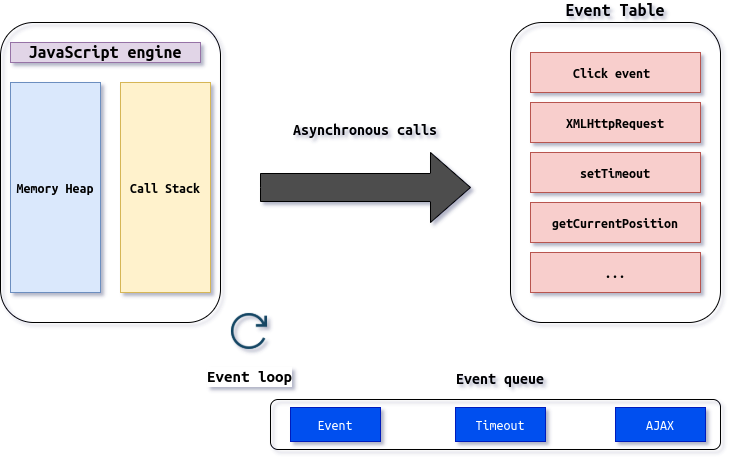

# JavaScript

- [JavaScript](#javascript)
  - [Concepts](#concepts)
    - [Syntax parser](#syntax-parser)
    - [Lexical environment](#lexical-environment)
    - [Execution context](#execution-context)
    - [Global execution context](#global-execution-context)
      - [Creation phase](#creation-phase)
      - [Execution phase](#execution-phase)
    - [Functional execution context](#functional-execution-context)
      - [Creation phase](#creation-phase-1)
      - [Execution phase](#execution-phase-1)
    - [Execution stack](#execution-stack)
    - [Outer environments](#outer-environments)
  - [Asynchronism](#asynchronism)
    - [Event Table](#event-table)
    - [Event Queue](#event-queue)
    - [Event Loop](#event-loop)
  - [Types and operators](#types-and-operators)
    - [Primitive types](#primitive-types)
    - [Operators](#operators)
      - [Coercion](#coercion)
  - [Objects and functions](#objects-and-functions)
    - [Functions](#functions)
    - [By reference & by value](#by-reference--by-value)
    - [this](#this)
    - [Immediately Invoked Functions Expressions (IIFE)](#immediately-invoked-functions-expressions-iife)
    - [Closures](#closures)
    - [call(), apply() and bind()](#call-apply-and-bind)
    - [Functional programming](#functional-programming)
  - [OOP and prototype oriented](#oop-and-prototype-oriented)
  - [Build objects](#build-objects)
    - [new & constructors](#new--constructors)
    - [Object.create()](#objectcreate)
    - [Property descriptor](#property-descriptor)
      - [Writable](#writable)
      - [Enumerable](#enumerable)
      - [Configurable](#configurable)
      - [get and set attributes](#get-and-set-attributes)
    - [ES6 & classes](#es6--classes)
  - [Miscellaneous](#miscellaneous)
    - [typeof & instanceof](#typeof--instanceof)
    - [Strict mode](#strict-mode)
  - [ES6 features](#es6-features)
    - [const & let](#const--let)
    - [Template literals](#template-literals)
    - [Destructuring](#destructuring)
    - [Object literal shorthand](#object-literal-shorthand)
    - [for...of loop](#forof-loop)
    - [Spread operator](#spread-operator)
    - [Rest operator](#rest-operator)
    - [Arrow function](#arrow-function)
    - [Default parameter](#default-parameter)
  - [Modules](#modules)
    - [Modules before ES6](#modules-before-es6)
      - [Module formats](#module-formats)
        - [AMD](#amd)
        - [CommonJS](#commonjs)
        - [UMD](#umd)
        - [System.register](#systemregister)
        - [ES6 format](#es6-format)
    - [Modules with ES6](#modules-with-es6)
    - [Module loaders](#module-loaders)
    - [Module bundlers](#module-bundlers)
  - [Links & references](#links--references)
    (IIFE)](#immediately-invoked-functions-expressions-iife)
    - [Closures](#closures)
    - [call(), apply() and bind()](#call-apply-and-bind)
    - [Functional programming](#functional-programming)
  - [OOP and prototype oriented](#oop-and-prototype-oriented)
  - [Build objects](#build-objects)
    - [new & constructors](#new--constructors)
    - [Object.create()](#objectcreate)
    - [Property descriptor](#property-descriptor)
      - [Writable](#writable)
      - [Enumerable](#enumerable)
      - [Configurable](#configurable)
      - [get and set attributes](#get-and-set-attributes)
    - [ES6 & classes](#es6--classes)
  - [Miscellaneous](#miscellaneous)
    - [typeof & instanceof](#typeof--instanceof)
    - [Strict mode](#strict-mode)
  - [ES6 features](#es6-features)
    - [const & let](#const--let)
    - [Template literals](#template-literals)
    - [Destructuring](#destructuring)
    - [Object literal shorthand](#object-literal-shorthand)
    - [for...of loop](#forof-loop)
    - [Spread operator](#spread-operator)
    - [Rest operator](#rest-operator)
    - [Arrow function](#arrow-function)
    - [Default parameter](#default-parameter)
  - [Modules](#modules)
    - [Modules before ES](#modules-before-es)
      - [Module formats](#module-formats)
        - [AMD](#amd)
        - [CommonJS](#commonjs)
        - [UMD](#umd)
        - [System.register](#systemregister)
        - [ES6 format](#es6-format)
    - [Modules with ES6](#modules-with-es6)
    - [Module loaders](#module-loaders)
    - [Module bundlers](#module-bundlers)
  - [Links & references](#links--references)

## Concepts

### Syntax parser

The syntax parser reads the code in order to transform it from human readable
code to something understandable by the computer. Basically, it's a program that
reads your code and determines what it does and if its grammar is valid.

### Lexical environment

Lexical environments exist in programming language where the location of the
code is important (for example, if a variable is inside a function or outside).

Lexical environment analyzes where the code stands and what is around it.

### Execution context

Execution contexts handle the currently running code. It also holds information
about the environment where the code is being executed.

An execution context has a reference to its outer environment (except for the
global execution context) and reserves memory space for functions and variables.

There are three types of execution contexts.

- **Global execution context**: created by the JS engine. This context creates a
  global object (named `window` for the browser and `global` in NodeJS) and the
  `this` variable.
- **Functional execution context**: a new functional execution context is
  created when a function is called.
- **Eval execution context**: Context inside the `eval` function.

### Global execution context



Like any execution context, the global one has two phases.

#### Creation phase

1. Create the global object.
2. Create the `this` variable and assign it to the global object.
3. Create the memory space for variables and functions.
4. Initialize the variables to `undefined` and place all function declarations
   in memory (hoisting).

#### Execution phase

In this phase, the JS engine will run the code line by line and execute it. It
will also assign values to variables.

### Functional execution context



#### Creation phase

1. Create an `arguments` object with the received parameters.
2. Create the `this` object and point it to the caller or, in absence of a
   caller, to the global object.
3. Create the memory space for variables and functions.
4. Initialize the variables to `undefined` and place all function declarations
   in memory (hoisting).

#### Execution phase

In this phase, the JS engine will run the code line by line and execute it. It
will also assign values to variables.

### Execution stack

The execution contexts are pushed in an **Execution Stack** (also known as
**Call Stack**). When a function is finished running through both the creation
and execution phase, it gets popped off the Execution Stack.



### Outer environments

Outer environments are references to an execution environment based on the
lexical environment.

For example, within a function, if a variable definition is not found, this
definition will be looked in the outer environment. This concept is called the
**scope chain** (scope = where I can access the variable, chain = references
links to the outer environments).

## Asynchronism

JavaScript is a mono-threaded programming language. The JavaScript engine inside
the browser executes the code synchronously (line by line). However, a web
browser is not only constituted of a JavaScript engine, there is also a
rendering engine and a module that handles HTTP requests. These interactions
between the JavaScript engine and the other parts of the browser work
asynchronously.

These interactions (they can be events, actions, notifications, etc.) are placed
in the **Event Queue** (function calls come from the **Event Table**). This
queue is consulted periodically when the Execution Stack is empty (that's the
role of the **Event Loop**).

### Event Table

JavaScript has an event table that keeps track of all events that will be
executed asynchronously.

When an asynchronous event occurs (timeout, click, mouse move...), the function
and its metadata are pushed in the table. Then, it send the function to be
executed to the Event Queue.

### Event Queue

The **Event Queue** (also know as **Callback Queue**) is a data structure
storing the events using the FIFO (First In First Out) policy. The functions to
execute will be picked up by the Event Loop.

### Event Loop

The **Event Loop** is a continuously running background task at regular
intervals. After each cycle, the Event loop checks if there is anything to be
executed in the Call Stack. If the Call Stack is empty, it checks in the Event
Queue. If the Event Queue is also empty, it waits for next event loop iteration.

When finding some task in the event queue, it picks it up, executes it and
does the same with the next event, etc.



## Types and operators

JavaScript is a programming language using **dynamic typing**. It means that we
don't specify the variable types, it's the JavaScript engine that finds it
during the code execution. A variable can have multiple types during its
existence.

Programming languages like Java or C# use **static typing**. It means that we
specify the type in the code and it can't change.

### Primitive types

JavaScript has **primitive types**. A primitive type represents a one value data
(unlike objects for example). There are 6 primitive types in JavaScript:

- `undefined`: represents the absence of existence. It is strongly advised to
  not assign this value to a variable.
- `null`: represents the absence of existence too but can be assigned to a
  variable.
- `boolean`: can have two values: `true` or `false`.
- `number`: in JavaScript integers and float are `number`. Numbers are [floating
  point number](https://en.wikipedia.org/wiki/IEEE_754).
- `string`: there are no char type in JavaScript, only strings.
- `symbol`: using the `Symbol()` function, it is possible to create symbol that
  are unique and immutable.

### Operators

Operators are simply [**functions with a precedence and an
associativity**](https://developer.mozilla.org/en-US/docs/Web/JavaScript/Reference/Operators/Operator_Precedence).

**Precedence** is a number (from 1 to 21) representing a priority associated to
the operator. 21 is the highest priority (for the grouping operator `(...)`) and
1 is the lowest (for the comma `... , ...`).

**Associativity** determines the order in which operators with the same
precedence will be evaluated. This associativity can be from right to left or
left to right.

#### Coercion

**Coercion** means to convert a value from one type to another (it appends often
in JavaScript because of the dynamic typing).

In JavaScript, due to this coercion, there are some strange behaviors.

- `null` is converted to 0 with some operators but not with the equality
  operator `==`. That means `null == 0` returns `false`.
- Unlike `==`, the strict equality operator `===` doesn't do coercion. If two
  values to compare haven't the same type, it will return `false`.
- the `||` operator will return the first element that coerce to `true`. It
  comes handy when defining default values.

```javascript
undefined || 'hello'; // returns "hello"
null || 'hello'; // returns "hello"
'' || 'hello'; // returns "hello"
```

> You can find a table of the different comparisons
> [here](https://developer.mozilla.org/en-US/docs/Web/JavaScript/Equality_comparisons_and_sameness).

## Objects and functions

### Functions

In JavaScript, **functions are objects**. These functions are called **first
class functions**. First class function means that we can do the same things
with functions as with other types (assign them to variables, create them on the
fly, pass them as parameters...).

Functions have the same characteristics as objects but with some extra features.
They can have a name (but it's optional) and the code of the function is a
property like any other. This property is invocable, meaning we can choose to
execute the associated code.

In JavaScript, an **expression** is a unit of code which is resulting in a
value. A **statement** on the other way won't return a value.

```javascript
// Function statement
function greeting() {
  console.log('Hello');
}

// Function expression
var anonymousGreeting = function () {
  console.log('Hi');
};
```

### By reference & by value

Objects (and functions) are passed and assigned by reference. That means if we
assign an object to a variable `a` and `a` to a variable `b`,`b` and `a` will
point to the same object in memory.

On the contrary, values of primitive types are passed by value. It means that a
copy of that value is done in memory.

The assignation operator `=` will create a new space in memory if the right
parameter doesn't exist in memory. If it exists, both parameters (each side of
the `=` sign) will point to the same memory space.

```javascript
// by value (primitives)
var a = 3;
var b;

b = a;
a = 2;

console.log(a); // 2
console.log(b); // 3

// by reference (all objects (including functions))
var c = { greeting: 'hi' };
var d;

d = c;
c.greeting = 'hello'; // mutate

console.log(c); // { greeting: "hello" }
console.log(d); // { greeting: "hello" }

// by reference (even as parameters)
function changeGreeting(obj) {
  obj.greeting = 'Hola'; // mutate
}

changeGreeting(d);
console.log(c); // { greeting: "Hola" }
console.log(d); // { greeting: "Hola" }

// equals operator sets up new memory space (new address)
c = { greeting: 'howdy' };
console.log(c); // { greeting: "howdy" }
console.log(d); // { greeting: "Hola" }
```

### this

The variable `this` is created for each execution context. In the case of a
function declaration (statement or expression), `this` references the global
object. In the case of a method of an object, `this` references this object.

Be careful, if you declare a function in an object method, the `this` variable
from this function will point to the global object again. To solve that, in the
method, you can create a `self` variable and assign it the `this` variable. Then
use the `self` variable wherever you used `this`.

```javascript
function a() {
  console.log(this); // window object
  this.newVariable = 'hello';
}

var b = function () {
  console.log(this); // window object
};

a();
console.log(newVariable); // hello
b();

var c = {
  name: 'The c object',
  log: function () {
    var self = this;
    self.name = 'Updated c object';
    console.log(self); // c object, c.name = 'Updated c object'
    var setName = function (newName) {
      // this references the global object, so we use the 'self' pattern
      self.name = newName;
    };
    setName('Updated again! The c object');
    console.log(self); // c object, c.name = 'Updated again! The c object'
  },
};

c.log();
```

### Immediately Invoked Functions Expressions (IIFE)

IIFE allows to create and execute functions on the fly. This pattern is very
useful for code safety and encapsulation. This allows to isolate your code and
avoid interferences with other JavaScript files or libraries by creating a new
execution context aside from the global one.

```javascript
// function statement
function greet(name) {
  console.log('Hello ' + name);
}
greet('John');

// using a function expression
var greetFunc = function (name) {
  console.log('Hello ' + name);
};
greetFunc('John');

// using an Immediately Invoked Function Expression (IIFE)
var greeting = (function (name) {
  return 'Hello ' + name;
})('John');

console.log(greeting);

// IIFE
var firstname = 'John';

(function (name) {
  var greeting = 'Inside IIFE: Hello';
  console.log(greeting + ' ' + name);
})(firstname); // IIFE

// we can also use the invoking parenthesis
// after the grouping ones: (function(name){ ... })(firstname);
```

### Closures

Closure is JavaScript feature. When a function `b` is created inside a function
`a`, when the function `a` is finished (it is not in the execution stack
anymore), its environment is still in memory. The function `b` has still a
reference to this space in memory thanks to its outer environment. In this way,
a value defined in the function `a` will still be available in the function `b`
even if the function `a` is finished.

```javascript
function greet(whatToSay) {
  return function (name) {
    // whatToSay is available thanks to closure
    console.log(whatToSay + ' ' + name);
  };
}

var sayHi = greet('Hi');
sayHi('Tony');
```

Below is a well known example of closure.

```javascript
// Issue
function buildFunctions() {
  var arr = [];

  for (var i = 0; i < 3; i++) {
    arr.push(
      // Since the function is not invoked,
      // no new execution context will be created.
      function () {
        console.log(i);
      }
    );
  }
  // At this moment, i = 3 and each function points
  // to the same outer environment where i = 3
  return arr;
}

var fs = buildFunctions();

fs[0](); // prints 3
fs[1](); // prints 3
fs[2](); // prints 3

// Solution
function buildFunctions2() {
  var arr = [];

  for (var i = 0; i < 3; i++) {
    arr.push(
      (function (j) {
        return function () {
          console.log(j);
        };
      })(i)
      // By using IIFE, we create a new execution context
      // where j is a variable with the wanted value
    );
  }

  return arr;
}

var fs2 = buildFunctions2();

fs2[0](); // prints 0
fs2[1](); // prints 1
fs2[2](); // prints 2
```

### call(), apply() and bind()

These three functions are available on each JavaScript functions. They are
related to the `this` variable.

- `bind()` takes an object as argument. This object will be associated to the
  `this` variable of the function returned by `bind()`. In this way, by calling
  `bind()` on a function, the latter is copied and `this` is assigned to the
  object passed as parameter to `bind()`.
- `call()` allows to call a function like we will do with the parenthesis, but,
  `call()` accepts, as a first argument, an object that will be associated to
  `this`. the other arguments of `call()` are the arguments of the function that
  we execute.
- `apply()` behaves in the same way as `call()` but the arguments list of the
  function are passed as an array.

```javascript
var person = {
  firstname: 'John',
  lastname: 'Doe',
  getFullName: function () {
    var fullname = this.firstname + ' ' + this.lastname;
    return fullname;
  },
};

var logName = function (lang1, lang2) {
  console.log('Logged: ' + this.getFullName());
  console.log('Arguments: ' + lang1 + ' ' + lang2);
  console.log('-----------');
};

var logPersonName = logName.bind(person);
logPersonName('en');

logName.call(person, 'en', 'es');
logName.apply(person, ['en', 'es']);

(function (lang1, lang2) {
  console.log('Logged: ' + this.getFullName());
  console.log('Arguments: ' + lang1 + ' ' + lang2);
  console.log('-----------');
}.apply(person, ['es', 'en']));

// function borrowing
var person2 = {
  firstname: 'Jane',
  lastname: 'Doe',
};

console.log(person.getFullName.apply(person2));

// function currying (creating a copy of a function but with some preset parameters)
function multiply(a, b) {
  return a * b;
}

var multipleByTwo = multiply.bind(this, 2); // we set the first parameter of the function to 2 (a = 2)
console.log(multipleByTwo(4)); // 4 here is the value of the b parameter

var multipleByThree = multiply.bind(this, 3);
console.log(multipleByThree(4));
```

### Functional programming

This paradigm is available in JavaScript thanks to first class functions. The
goal is to use functions in order to separate and make the code more safe and
easier to test. Moreover, this paradigm advocates the immutability.

```javascript
function mapForEach(arr, fn) {
  var newArr = [];
  for (var i = 0; i < arr.length; i++) {
    newArr.push(fn(arr[i]));
  }

  return newArr;
}

var arr1 = [1, 2, 3];
console.log(arr1);

var arr2 = mapForEach(arr1, function (item) {
  return item * 2;
});
console.log(arr2);

var arr3 = mapForEach(arr1, function (item) {
  return item > 2;
});
console.log(arr3);

var checkPastLimit = function (limiter, item) {
  return item > limiter;
};
var arr4 = mapForEach(arr1, checkPastLimit.bind(this, 1));
console.log(arr4);

var checkPastLimitSimplified = function (limiter) {
  return function (limiter, item) {
    return item > limiter;
  }.bind(this, limiter);
};

var arr5 = mapForEach(arr1, checkPastLimitSimplified(1));
console.log(arr5);
```

## OOP and prototype oriented

JavaScript uses **prototypal inheritance**. A **prototype** is an object that
every JavaScript object has (including function). This prototype can
reference another prototype and so on (it's called the **prototype chain**).

When we use the `.` operator to access a property of an object, this operator
will first check for the property on the object then, if the property doesn't
exists, it will check on the object's prototype.

The prototype is hidden from the user, it is the JavaScript engine that will go
through this chain. A prototype can be shared by several objects.

In JavaScript, all the types (except primitive types and the generic object
`Object`) have a prototype. At the end, the prototype chain ends on the `Object`
object.

A JavaScript object has the capability to modify its own methods and properties,
this is called **reflection**.

## Build objects

### new & constructors

The keyword `new` has been implemented in JavaScript to appeal developers coming
from Java (even the language name has been chosen for that). `new` is an
operator allowing to create objects (as well as the object literal syntax).

When `new` is called, an empty object is created and then, the function on the
right side of the `new` operator is called. This function call creates a new
execution context so a `this` variable is created too. When using the `new`
operator, `this` refers to the empty object.

When the function is finished, the `this` object is returned by the JavaScript
engine unless the function returns something else.

A function used to create objects is called a **function constructor**.

All functions have a `prototype` property. This property is not used unless the
function is a constructor (so only when using the `new` operator). This property
`prototype` doesn't contain the value of the function prototype but the
prototype of all objects that will be created with this constructor function
(it's an object containing all the properties that will be inherited). This
feature allows, when we create multiple objects from this constructor, to add a
property or a method to the prototype so all objects will have it.

In order to reduce memory consumption, it is recommended to declare methods on
prototype because they will be defined only one time (on the contrary, if you
define them on the constructor, methods will be defined for each object).

```javascript
function Person(firstname, lastname) {
  console.log(this);
  this.firstname = firstname;
  this.lastname = lastname;
  console.log('This function is invoked.');
}
// getFullName() method will be available for
// all objects created with the Person() constructor.
Person.prototype.getFullName = function () {
  return this.firstname + ' ' + this.lastname;
};

var john = new Person('John', 'Doe');
console.log(john);

var jane = new Person('Jane', 'Doe');
console.log(jane);
// We can add methods or properties even after the object creation.
Person.prototype.getFormalFullName = function () {
  return this.lastname + ', ' + this.firstname;
};

console.log(john.getFormalFullName());
```

:warning: Don't forget the `new` operator for constructor function. You can call
the constructor function without it but the function will return `undefined`.
This is why we use a capital letter as a first letter for constructor function
name.

:warning: You should avoid using built in JavaScript functions for primitive
types as constructors (for example: `new Number(5)`) because they return objects
and not primitive types. You can use them as cast functions.

:warning: For arrays, you should avoid using `for...in` because an array is an
object and each elements of this array is an object property. If a library adds
a property or a method to the `Array` prototype, `for...in` will list it as an
element of that array. It is better to use the standard `for` loop.

```javascript
Array.prototype.myFeature = 'cool';
var arr = ['John', 'Jane', 'Jim'];
for (var prop in arr) {
  console.log(prop + ': ' + arr[prop]);
}

// 0: John
// 1: Jane
// 2: Jim
// myFeature: cool  !!!!!
```

### Object.create()

The `create()` method from the generic object `Object` allows to do prototypal
inheritance. It takes a prototype as a first argument and returns an empty
object with the prototype passed as argument. Methods and properties of this
object can be overridden thanks to the prototype chain.

`create()` is not available in older web browsers, so we implement what is
called polyfills (code adding a feature that doesn't exist on a system).

```javascript
// polyfill
if (!Object.create) {
  Object.create = function (o) {
    if (arguments.length > 1) {
      throw new Error(
        'Object.create implementation' + ' only accepts the first parameter.'
      );
    }
    function F() {}
    F.prototype = o;
    return new F();
  };
}

var person = {
  firstname: 'Default',
  lastname: 'Default',
  greet: function () {
    return 'Hi ' + this.firstname;
  },
};

var john = Object.create(person);
john.firstname = 'John';
john.lastname = 'Doe';
console.log(john);
```

### Property descriptor

Every object property is more than just a name and value pair. We can see more
metadata of a property by using a property descriptor.

We can log this descriptor by using the `Object.getOwnPropertyDescriptor()`
function.

```javascript
var videoGame = {
  name: 'Zelda OOT',
  maker: 'Nintendo',
  rating: '21/20'
};

console.log(Object.getOwnPropertyDescriptor(videoGame, 'rating'));
// Output will be
{
  configurable: true,
  enumerable: true,
  value: "21/20",
  writable: true
}
```

We can see that in addition to the `value` property, we have three more
properties. All of these properties are booleans. These properties can be
changed by using the `Object.defineProperty()` function.

#### Writable

The `writable` attribute tells whether or not the value of this property can be
changed.

```javascript
var videoGame = {
  name: 'Zelda OOT',
  maker: 'Nintendo',
  rating: '21/20',
};

Object.defineProperty(videoGame, 'rating', { writable: false });
videoGame.rating = '0/20';
// Throws error in strict mode
// Uncaught TypeError: Cannot assign to read only property

console.log(videoGame.rating);
// Output will be 21/20 in non-strict mode
```

If a property has a `writable` attribute set to `false`, in strict mode you will
have an error when trying to modify this value. In non strict mode, you won't
have an error but the value will not be modified.

An interesting thing happens if the property which will be non writable
(`writable` set to `false`) is an object. In this scenario, you can't assign
another value to this property (in other words replace the object), BUT you can
modify the properties of this object.

```javascript
'use strict';
var videoGame = {
  name: 'Zelda OOT',
  maker: 'Nintendo',
  rating: {
    value: '21/20',
    year: '1998'
  }
};

Object.defineProperty(videoGame, 'rating', {writable: false});
videoGame.rating.value = '0/20';
console.log(videoGame.rating);

//Output will be
{
  value: "0/20",
  year: "1998"
}
```

If you still want to make all these object properties non-writable, you can use
the `Object.freeze()` function.

```javascript
var videoGame = {
  name: 'Zelda OOT',
  maker: 'Nintendo',
  rating: { value: '21/20', year: '1998' },
};

Object.defineProperty(videoGame, 'engine', { writable: false });
Object.freeze(videoGame.rating);
videoGame.rating.value = '0/20';
// Throws error in strict mode

console.log(videoGame.rating.value);
// Output will be 21/20 in non-strict mode
```

#### Enumerable

Enumerable properties means that you can loop over them. By default, properties
of any object are enumerable (`enumerable: true`). You can set this attribute to
`false` by using the `Object.defineProperty()` function.

```javascript
var videoGame = {
  name: 'Zelda OOT',
  maker: 'Nintendo',
  rating: { value: '21/20', year: '1998' },
};

Object.defineProperty(videoGame, 'maker', { enumerable: false });
for (let propName in videoGame) {
  console.log(propName);
}
// Output:   name rating  (property maker is missing)

var keys = Object.keys(videoGame);
console.log(keys);
// Output:   ["name", "rating"] (property maker is missing)
```

#### Configurable

By default, we can configure all the attributes of an object. If set to `false`,
the `configurable` attribute will prevent certain attributes of the property to
be changed as well as preventing the property deletion.

```javascript
var videoGame = {
  name: 'Zelda OOT',
  maker: 'Nintendo',
  rating: { value: '21/20', year: '1998' },
};

Object.defineProperty(videoGame, 'name', { configurable: false });

Object.defineProperty(videoGame, 'name', { enumerable: false });
// TypeError: Cannot redefine property: name

Object.defineProperty(videoGame, 'name', { writable: false });
// No error

Object.defineProperty(videoGame, 'name', { configurable: true });
// Throws error

delete videoGame.name;
// TypeError: Cannot delete property 'name' (strict mode only)
```

The `writable` attribute is not impacted by the `configurable` attribute.

Of course, `Object.defineProperty()` can be used to modify all attributes at
once.

```javascript
var videoGame = {
  name: 'Zelda OOT',
  maker: 'Nintendo',
  rating: '21/20',
};

Object.defineProperty(videoGame, 'name', {
  configurable: false,
  writable: false,
  enumerable: false,
  value: '0/20',
});
```

#### get and set attributes

`get` and `set` are attributes that can be defined using the
`Object.defineProperty()` function. Both are functions working as getter and
setter for the property. When a property is accessed, `get` function is called
without any arguments. When a property is assigned a value, `set` function is
called with the value.

```javascript
var videoGame = {
  name: 'Zelda OOT',
  maker: 'Nintendo',
  rating: '21/20',
};

Object.defineProperty(videoGame, 'details', {
  get: function () {
    return (
      this.name + ' is a ' + this.maker + ' game rated ' + this.rating + '.'
    );
  },
  set: function (details) {
    this.name = details.split(' ')[0];
  },
});
```

### ES6 & classes

ES6 (or ECMAScript 2015) adds the `class` notion to JavaScript. It allows to
create objects and a function called `constructor()`.

There is a difference between classes in JavaScript and classes in other
programming language. In other languages, a class is a template, a model
representing what an object should be. In JavaScript, a class is already an
object and we use it to create other object.

In order to define a prototype of a class with this new syntax, you should use
the keyword `extends`, then in the constructor, call the prototype constructor
with the `super()` keyword.

Keep in mind that these new terms are syntactic sugar, they don't change how it
works under the hood.

## Miscellaneous

### typeof & instanceof

The `typeof` operator allows to get the type of the variable placed at the
right of the operator. Keep in mind that this operator will return `object` for
arrays and functions.

The `instanceof` operator allows to check if a variable has in its prototype
chain the object placed at the right side of the operator. It returns a boolean.

> :warning: `typeof null` returns `object`. This is considered a bug in JavaScript.

```javascript
var a = 3;
console.log(typeof a); // number

var b = 'Hello';
console.log(typeof b); // string

var c = {};
console.log(typeof c); // object

var d = [];
console.log(typeof d); // object (weird!)
console.log(Object.prototype.toString.call(d)); // [object Array] (better!)

function Person(name) {
  this.name = name;
}

var e = new Person('Jane');
console.log(typeof e); // object
console.log(e instanceof Person); // true

console.log(typeof undefined); // undefined (makes sense)
console.log(typeof null); // object (a bug since, like, forever...)

var z = function () {};
console.log(typeof z); // function
```

### Strict mode

By putting the `"use strict"` string at the first line of the file or at the
beginning of a function definition, the JavaScript engine will use stricter rules
for your code.

The different JavaScript engines don't implement these rules the same way.

## ES6 features

Here are some new ES6 features.

### const & let

ES6 comes with two new ways to declare variables.

- `const` allows to declare a variable with a constant value. It can't be
  changed through reassignment and it can't be declared again.
- `let`: allows to declare block-scoped variable, unlike the `var` keyword,
  which defines a variable globally or locally to an entire function. Another
  difference with `var` is that `let` is not evaluated during the creation phase
  (meaning it will not be set to `undefined`), it means that accessing a `let`
  variable before defining it will throw a `ReferenceError` (and not `undefined`
  like with `var`).

Both `const` and `let` won't create properties in the global object when
declared globally.

### Template literals

By using the backticks to write strings, it is possible to write multi lines
strings and concatenate variables with `${}`.

```javascript
const a = 'Hello';
console.log(`${a} World`);
```

### Destructuring

Destructuring allows to assign properties or elements from an array or from an
object to variables.

```javascript
const [first, second, third] = [1, 2, 3];
const { first, second, third } = {
  first: 1,
  second: 2,
  third: 3,
};
```

### Object literal shorthand

Object literal shorthand means simplify the initialization of a property within
an object.

```javascript
const a = 'Hello';
const b = {
  a, // before we would write: a: a,
  c: 'Yes',
};
```

### for...of loop

This is a new way of looping over iterable objects such as Array, Map, Set,
String, TypedArray or the `arguments` object.

### Spread operator

The spread operator `...` allows to decompose a iterable object into a variable
list.

```javascript
const myString = "foo bar"
// strings are iterable
[...myString] // ["f", "o", "o", " ", "b", "a", "r"]

function sum(x, y, z) {
  return x + y + z;
}

const numbers = [1, 2, 3];

console.log(sum(...numbers));
// expected output: 6
```

### Rest operator

The rest operator `...` allows, when used on a function parameter, to reunite
arguments in one array.

```javascript
function logArgs(...args) {
  console.log(args);
}

logArgs('hi', 3, 'Bob'); // args == ['hi', 3, 'Bob']
```

### Arrow function

Arrow functions are a shorter way to define functions. There is a difference though
between array and normal functions. Arrow functions don't have their own bindings to the
`this`, `arguments`, `super`, or `new.target` keywords. With arrow functions the
`this` keyword always represents the object that defined the arrow function
(the `this` value of the enclosing lexical scope).

> Avoid using the arrow function for event handlers,
> object methods, class methods, prototype methods,
> and functions that use the arguments object.

Example with regular function:

```javascript
//Regular Function:
hello = function () {
  document.getElementById('demo').innerHTML += this;
};

//The window object calls the function:
window.addEventListener('load', hello);

//A button object calls the function:
document.getElementById('btn').addEventListener('click', hello);

// When clicking on the button, it will print the button object.
```

Example with arrow function:

```javascript
//Arrow Function:
hello = () => {
  document.getElementById('demo').innerHTML += this;
};

//The window object calls the function:
window.addEventListener('load', hello);

//A button object calls the function:
document.getElementById('btn').addEventListener('click', hello);

// When clicking on the button, it will print the window object.
```

### Default parameter

It is possible to assign a default value to function parameter.

```javascript
function add(a = 3, b = 5) {
  return a + b;
}

add(4, 2); // 6
add(4); // 9
add(); // 8
```

## Modules

A module is a small unit of independent and reusable code. Originally,
JavaScript had not this module concept, most JavaScript scripts were developed
in a single file because it was not possible to reference another file in
JavaScript.

Code separation have a lot of advantages.

- The code is more readable.
- The code is reusable in the same application or in other applications.
- Dependencies between modules are simplified. Each module shows its
  dependencies, so it's easier to identify a dependency issue.
- It's easier to add one or several modules to the current code.
- Modules promote encapsulation and hide complexity.

Developers implemented different ways of creating modules.

Keep in mind that these information about modules will be important when you
work with TypeScript for example.

### Modules before ES6

There are two main patterns used before ES6 to simulate modules.

The first one is IIFE, that we already saw. It is used for most of the
JavaScript libraries out there (like jQuery for example) to isolate code.

The second one is called **Revealing module pattern**. It's quite similar to an
IIFE, but we assign the return value to a variable.

```javascript
// Expose module as global variable
var singleton = (function () {
  // Inner logic
  function sayHello() {
    console.log('Hello');
  }

  // Expose API
  return {
    sayHello: sayHello,
  };
})();

// Access module functionality
singleton.sayHello();
```

A module can also expose a constructor function.

```javascript
// Expose module as global variable
var Module = function () {
  // Inner logic
  function sayHello() {
    console.log('Hello');
  }

  // Expose API
  return {
    sayHello: sayHello,
  };
};

var module = new Module();
module.sayHello();
```

#### Module formats

Many different syntaxes were invented for defining modules.

- Asynchronous Module Definition (AMD)
- CommonJS
- Universal Module Definition (UMD)
- System.register
- ES6 modules

##### AMD

The [AMD](https://github.com/amdjs/amdjs-api/wiki/AMD) format is used in
browsers and uses a `define` function to defined modules.

##### CommonJS

The [CommonJS](http://www.commonjs.org/) format is used in Node.js and uses
`require` and `module.exports` to define dependencies and modules.

##### UMD

The [UMD](https://github.com/umdjs/umd) format can be used both in the browser
and in Node.js.

##### System.register

The
[System.register](https://github.com/ModuleLoader/es-module-loader/blob/master/docs/system-register.md)
format was designed to support the ES6 module syntax in ES5.

##### ES6 format

With ECMAScript2015, Javascript now supports a native module format.

### Modules with ES6

ES6 modules uses an `export` keyword to export a module's public API and an
`import` keyword to import parts that a module exports.

```javascript
// lib.js

// Export the function
export function sayHello() {
  console.log('Hello');
}

// Do not export the function
function somePrivateFunction() {
  // ...
}

/* in another file */

import { sayHello } from './lib';

sayHello();
```

We can use aliases for imports, load an entire module at once or even use
default exports.

```javascript
// Alias
import { sayHello as say } from './lib';

say();

// import the whole module
import * as lib from './lib';

lib.sayHello();

// lib.js
// Export default function
export default function sayHello() {
  console.log('Hello');
}

// Export non-default function
export function sayGoodbye() {
  console.log('Goodbye');
}

/* in another file */
import sayHello, { sayGoodbye } from './lib';

sayHello();
sayGoodbye();
```

### Module loaders

A module loader interprets and loads a module written in a certain module
format. A **loader runs at runtime**.

Most popular module loaders are:

- [RequireJS](https://requirejs.org/): loader for modules in AMD format
- [SystemJS](https://github.com/systemjs/systemjs): loader for modules in AMD,
  CommonJS, UMD or System.register format

### Module bundlers

A module bundler replace a module loader. Unlike a module loader, a **module
bundler runs at build time**.

Most popular module bundlers are:

- [Browserify](http://browserify.org/): bundler for CommonJS modules
- [Webpack](https://webpack.github.io/): bundler for AMD, CommonJS, ES6 modules

## Links & references

- https://github.com/leonardomso/33-js-concepts: A list of free articles and
  videos about JavaScript main concepts.
- https://www.udemy.com/course/understand-javascript/learn/lecture/2237612#overview:
  A course about how JavaScript works.
- https://codeburst.io/javascript-object-property-attributes-ac012be317e2 :
  Article on property descriptor.
- https://www.jvandemo.com/a-10-minute-primer-to-javascript-modules-module-formats-module-loaders-and-module-bundlers/
  : Article on JavaScript modules.
- https://www.javascripttutorial.net/ : Good JavaScript tutorial website.
